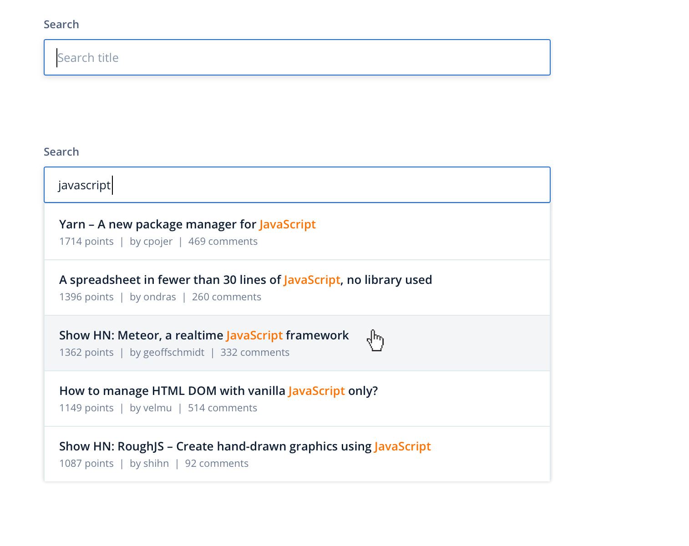
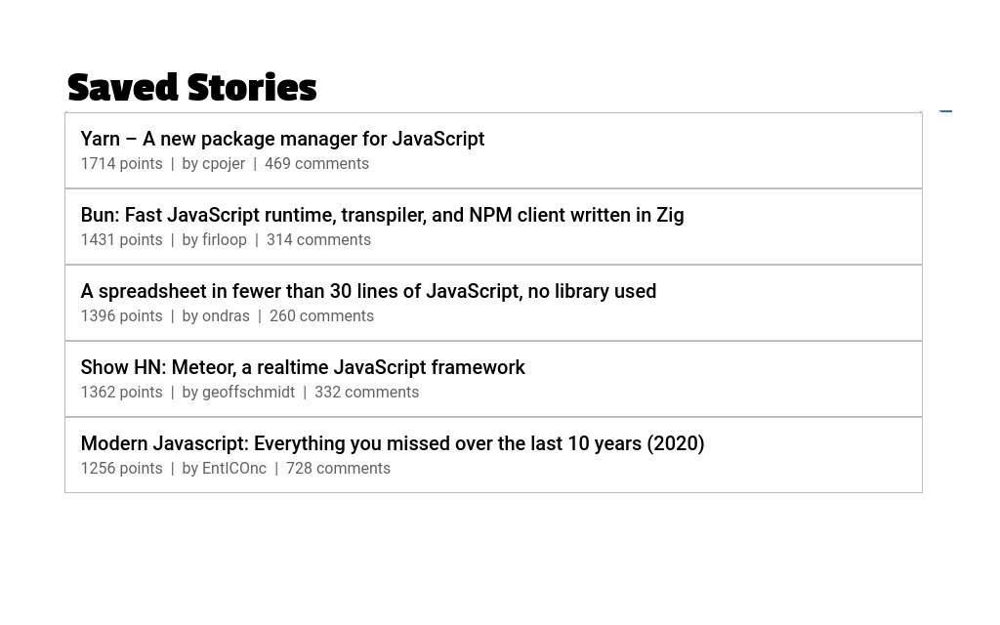
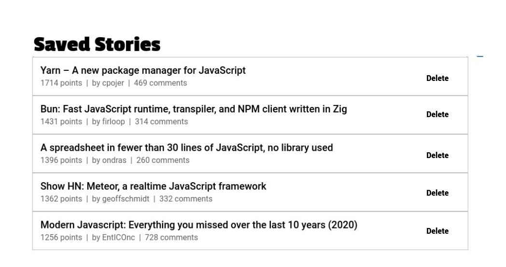

# Assignment

## Task 1

Create an auto-suggest input field where the user would type at least 3 letters of a Hacker News story title and display the available stories in a dropdown list, similar to the following image:

## Task 2

When a user selects any of the returned stories (clicks on a result row), it should be added on a list as shown bellow.

## Task 3

User should also be able to remove items from the saved list, (clicks on a delete button)

### Requirements

- Implement your solution using the given starter template.
- Your target browser is the latest Chrome or Firefox, no need to cater for outdated browsers.
- Use the Hacker News Search API to retrieve stories (https://hn.algolia.com/api/v1/search?query=javascript). For the purpose of this exercise you will need the following properties from the response: "title" (the story title), "author" (the story author), "num_comments" (the number of comments), "points" (number of story points).
- Do not focus on styling, focus instead on delivering the requested functionality.
- The dropdown should trigger on typing 3+ chars,
- You may use any functional libraries of your choice, e.g. lodash, rxjs, redux, react-query, etc.
- Tests are highly valued.
- Preserve session optional
- Highlight search term optional

### Time requirement

2 hours
